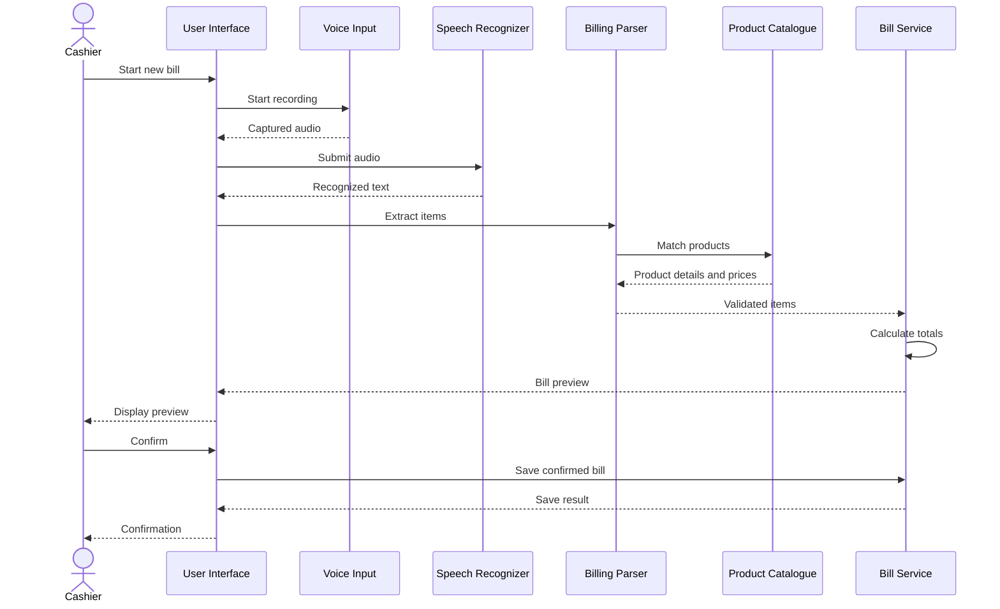

# Sequence Diagram – Voice Bill Creation

## Participants
Cashier, User Interface, Voice Input, Speech Recognizer, Billing Parser, Product Catalogue, Bill Service.

## Mermaid Sequence Diagram

```mermaid
sequenceDiagram
  actor Cashier
  participant UI as User Interface
  participant Voice as Voice Input
  participant STT as Speech Recognizer
  participant Parser as Billing Parser
  participant Catalogue as Product Catalogue
  participant Bill as Bill Service
  Cashier->>UI: Start new bill
  UI->>Voice: Start recording
  Voice-->>UI: Captured audio
  UI->>STT: Submit audio
  STT-->>UI: Recognized text
  UI->>Parser: Extract items
  Parser->>Catalogue: Match products
  Catalogue-->>Parser: Product details and prices
  Parser-->>Bill: Validated items
  Bill->>Bill: Calculate totals
  Bill-->>UI: Bill preview
  UI-->>Cashier: Display preview
  Cashier->>UI: Confirm
  UI->>Bill: Save confirmed bill
  Bill-->>UI: Save result
  UI-->>Cashier: Confirmation
```
